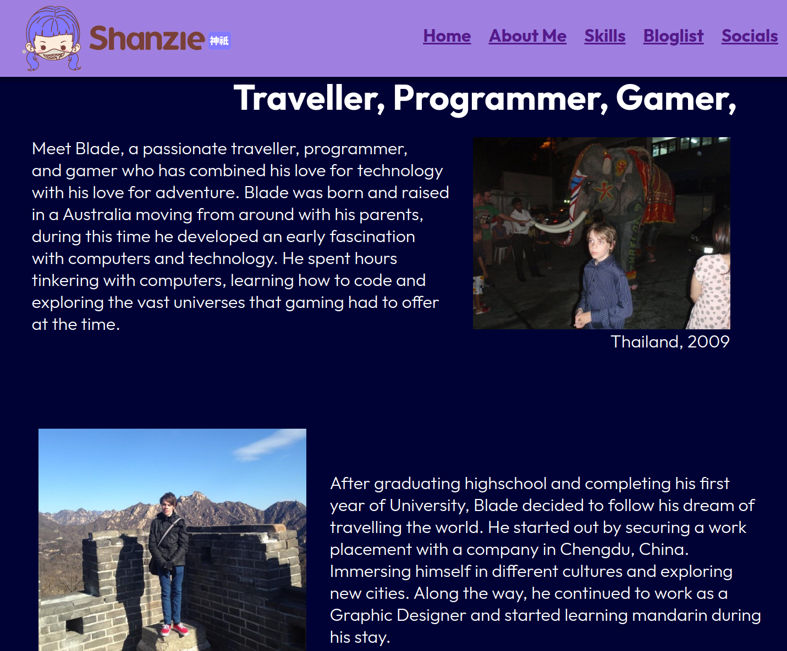
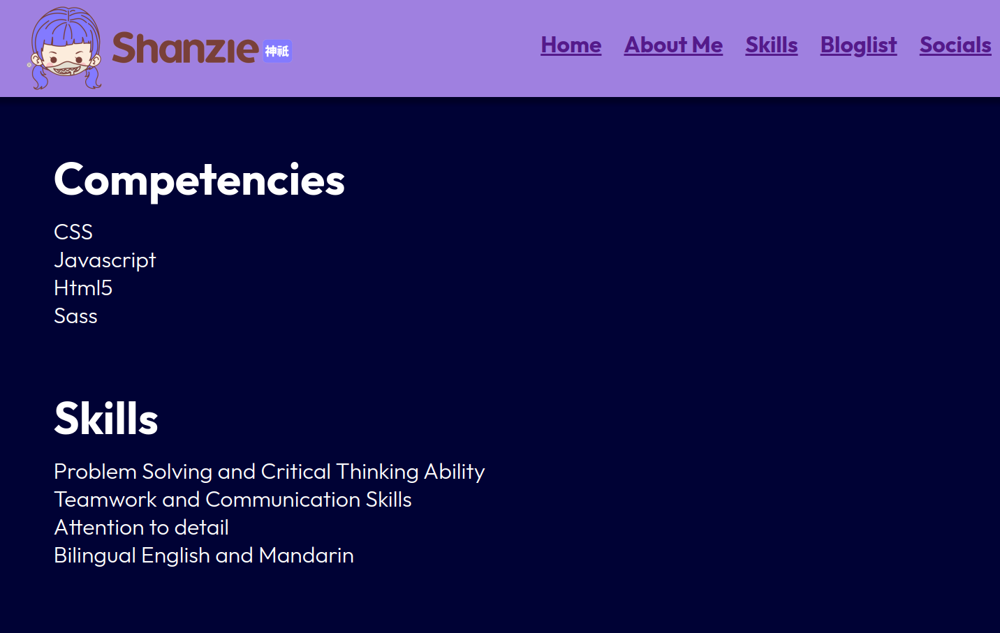
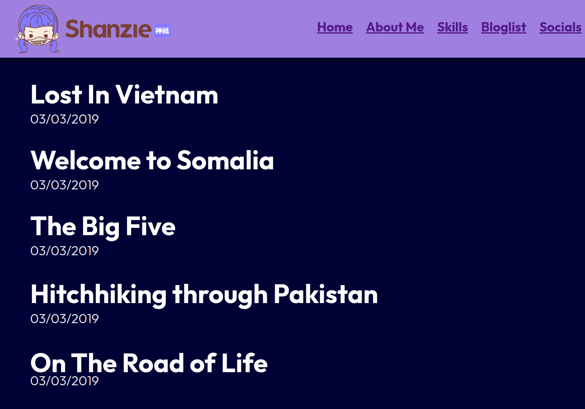
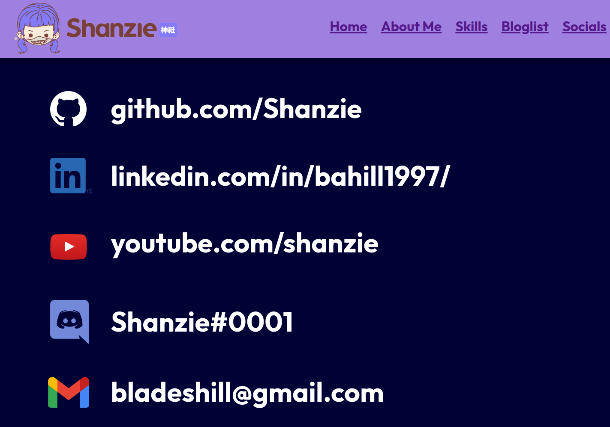

## A link (URL) to your published portfolio website

## A link to your GitHub repo
https://github.com/Shanzie/BladeHill_T1A2
## A link to your presentation video

## Description of your portfolio website, including,
## Purpose

This is my own personal portfolio website giving information about me, my skills, history and social links.

## Functionality / features

The website has a navigation bar and links to multiple other websites.

## Sitemap

## Screenshots

# Home

# About Me

# Skills

# Bloglist

# Socials

## Target audience

The target audience for this website is an employer that is looking to engage a dev or IT professional.

## Tech stack (e.g. html, css, deployment platform, etc)